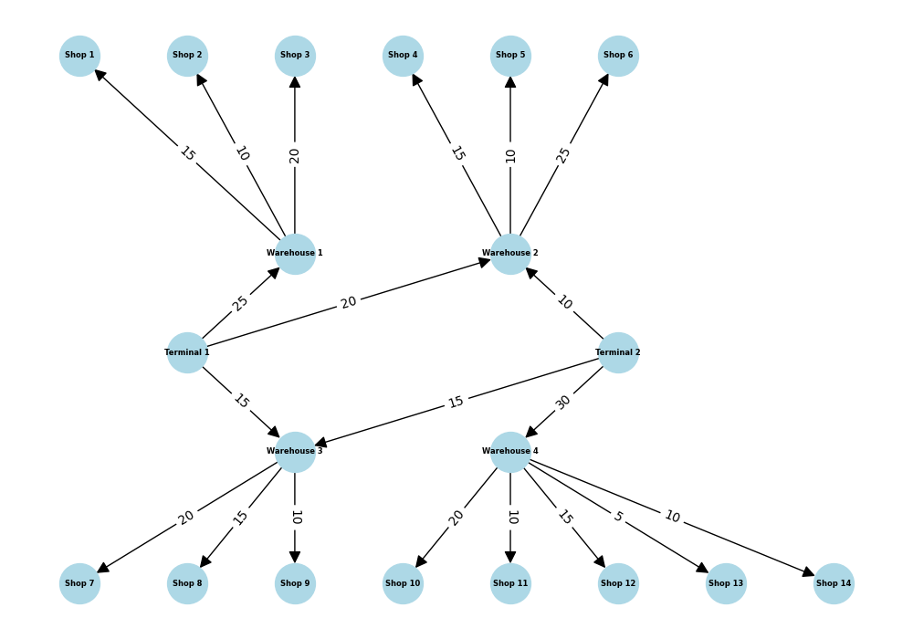

# Task 1. Application of the maximum flow algorithm for goods logistics

---

|Store     | Terminal 1 | Terminal 2 |
|----------|:----------:|:----------:|
|Shop 1    |     15     |     0      |
|Shop 2    |     10     |     0      |
|Shop 3    |     20     |     0      |
|Shop 4    |     15     |     10     |
|Shop 5    |     10     |     10     |
|Shop 6    |     20     |     10     |
|Shop 7    |     15     |     15     |
|Shop 8    |     15     |     15     |
|Shop 9    |     10     |     10     |
|Shop 10   |     0      |     20     |
|Shop 11   |     0      |     10     |
|Shop 12   |     0      |     15     |
|Shop 13   |     0      |     5      |
|Shop 14   |     0      |     10     |

---

## 1. Which terminals provide the largest flow of goods to stores?

Despite the fact that the highest flow capacity is:
- from *terminal 2* to the *4th warehouse* - **30 units**, and
- from *terminal 1* to the *1st warehouse* - **25 units**.

However, the maximum capacity is:
- from *terminal 1* to *shops 3 and 6* - **20 units**, and
- from *terminal 2* to *shop 10* - **20 units**.

## 2. Which routes have the lowest throughput and how does this affect the overall flow?

Low-capacity routes can act as bottlenecks, limiting the overall flow from Terminals to their respective destinations.

For example, the route from `Terminal 2 --(30 units)--> Warehouse 4 --(5 units)--> Shop 13` has only 5 units capacity severely limits the flow of goods to Shop 13.

Similarly, the route from `Terminal 1 --(25 units)--> Warehouse 1 --(10 units)--> Shop 2` has only 10 units final capacity, which is less than the capacity of the route from Terminal 1 to Warehouse 1.

## 3. Which stores have received the least amount of goods and can their supply be increased by increasing the capacity of certain routes?

*Shop 13 received the least amount of goods, only 5 units.*

The other lowest figures are:
- *Shop 2*: 10 units (from Terminal 1)
- *Shop 5*: 10 units (from Terminal 2)
- *Shop 9*: 10 units (from Terminal 1 and 2)
- *Shop 11*: 10 units (from Terminal 2)
- *Shop 14*: 10 units (from Terminal 2)

To increase the supply to Shops, we can increase the capacity of the route from Warehouses -> Shops. This would allow more goods to flow to Shops.

## 4. Are there any bottlenecks that can be removed to improve the efficiency of the logistics network?

Yes, there are bottlenecks that can be removed to improve the efficiency of the logistics network.

- Modernization or expansion of infrastructure in these areas will increase their capacity.

- It is also possible to reconsider the distribution of flows: sometimes redirecting through alternative routes (if possible in the logistics scheme) can provide more flows without significant investments in modernization.

---

# Task 2. Comparing the effectiveness of OOBTree and a dictionary for range queries

## OOBTree

Total range_query time for *OOBTree*: **0.093383** seconds

## Dict

Total range_query time for *Dict*: **6.736072** seconds